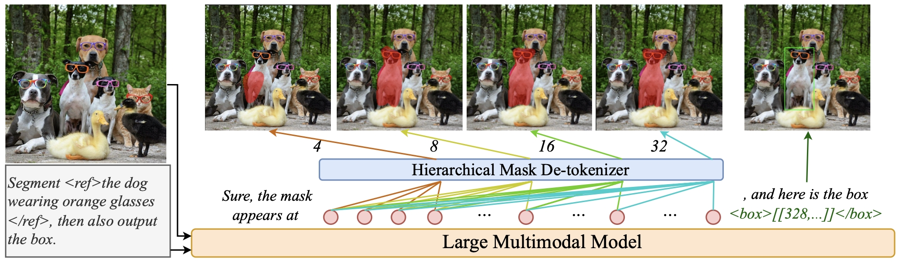

<div align="center">

# HiMTok: Learning Hierarchical Mask Tokens for Image Segmentation with Large Multimodal Model



</div>

## News
- [2025.3.20] We released the fine-tuned checkpoint (InternVL $\times$ HiMTok), available [here](https://huggingface.co/yayafengzi/InternVL2_5-HiMTok-8B). 
- [2025.3.17] We released the [paper](https://arxiv.org/abs/2503.13026).

## Abstract
The remarkable performance of large multimodal models (LMMs) has attracted significant interest from the image segmentation community.
To align with the next-token-prediction paradigm, current LMM-driven segmentation methods either use object boundary points to represent masks or introduce special segmentation tokens, whose hidden states are decoded by a segmentation model requiring the original image as input.
However, these approaches often suffer from inadequate mask representation and complex architectures, limiting the potential of LMMs.
In this work, we propose the Hierarchical Mask Tokenizer (HiMTok), which represents segmentation masks with up to 32 tokens and eliminates the need for the original image during mask de-tokenization.
HiMTok allows for compact and coarse-to-fine mask representations, aligning well with the LLM next-token-prediction paradigm and facilitating the direct acquisition of segmentation capabilities.
We develop a 3-stage training recipe for progressive learning of segmentation and visual capabilities, featuring a hierarchical mask loss for effective coarse-to-fine learning.
Additionally, we enable bidirectional information flow, allowing conversion between bounding boxes and mask tokens to fully leverage multi-task training potential.
Extensive experiments demonstrate that our method achieves state-of-the-art performance across various segmentation tasks,while also enhancing visual grounding and maintaining overall visual understanding.

## Installation
```
conda env create -f environment.yml
```

## Demo
Run [inference_internvl.py](inference_internvl.py) to generate a segmentation mask for an object in the image.

## Training
Prepare data like [example/anns/seg_data_with_mask.jsonl](example/anns/seg_data_with_mask.jsonl).

Important keys contained in JSONL files:
```
- "image": Source image.
- "mask": Mask image.
- "conversations": Conversations between human and gpt. The mask placeholder is <|mt_start|><|mt_0|>...<|mt_end|>.
```

For second stage training, run `bash scripts/train/train_himtok_stage2_internvl.sh` to train InternVL with HiMTok.

For third stage training, run `bash scripts/train/train_himtok_stage3_internvl.sh` to train InternVL with mask tokens.

You can also convert the mask placeholder to mask tokens by [convert_mask2tokens.py](convert_mask2tokens.py) before training.

## Evaluation

Following the evaluation pipeline in [EVALUATE.md](EVALUATE.md).

## Citation
If you find this project useful in your research, please consider citing:

```BibTeX
@article{wang2025himtok,
  title={HiMTok: Learning Hierarchical Mask Tokens for Image Segmentation with Large Multimodal Model},
  author={Wang, Tao and Cheng, Changxu and Wang, Lingfeng and Chen, Senda and Zhao, Wuyue},
  journal={arXiv preprint arXiv:2503.13026},
  year={2025}
}
```

## Acknowledgement
This project is built with reference to [InternVL](https://github.com/OpenGVLab/InternVL) and [TiTok](https://github.com/bytedance/1d-tokenizer).

## License
```
Copyright 2025-UniUbi.

Licensed under the Apache License, Version 2.0 (the "License");
you may not use this file except in compliance with the License.
You may obtain a copy of the License at

    http://www.apache.org/licenses/LICENSE-2.0

Unless required by applicable law or agreed to in writing, software
distributed under the License is distributed on an "AS IS" BASIS,
WITHOUT WARRANTIES OR CONDITIONS OF ANY KIND, either express or implied.
See the License for the specific language governing permissions and
limitations under the License.
```
